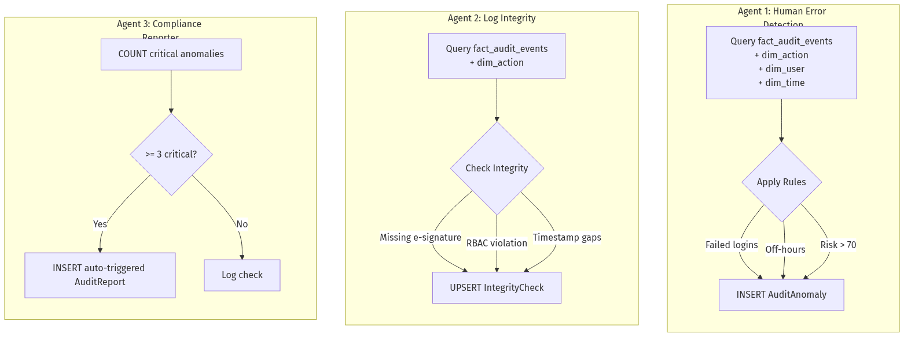

# eSTAR AI Platform: Audit Trail Microservice

A highly performant, 21 CFR Part 11 compliant audit trail microservice powered by **FastAPI**, **PostgreSQL**, and **Google Gemini AI**. 

This service acts as the central brain for the ePharmic AI Platform's logs, maintaining an immutable record of system events, cryptographic integrity checks, and autonomous AI-driven anomaly detection.

## Features
- **FastAPI REST API**: High-performance, asynchronous endpoints serving the React frontend.
- **Snowflake Database Schema**: Complex PostgreSQL schema tracking users, roles, compliance modules, actions, time dimensions, and audit facts.
- **Autonomous AI Agents (APScheduler)**:
  - `Agent 1`: Log Analyzer (Detects human error patterns like repeated failed logins).
  - `Agent 2`: Integrity Monitor (Validates electronic signatures and Role-Based Access Controls).
  - `Agent 3`: Compliance AI (Triggers proactive summaries).
- **Gemini 2.5 Flash Integration**: Connects directly to Google's generative AI to produce regulatory-ready, on-demand compliance reports based on real-time database facts.

### Agent Workflow


## Getting Started

### 1. Prerequisites
- Python 3.11+
- PostgreSQL
- Docker (optional for easiest DB setup)

### 2. Environment Setup

Copy the example environment file and add your actual API keys:
```bash
cp .env.example .env
```
Ensure you add your `GEMINI_API_KEY` to the `.env` file. Do NOT commit the `.env` file to version control.

### 3. Database Initialization

Start your PostgreSQL instance. If you are using Docker, run:
```bash
docker run -d --name epharmic-pg -e POSTGRES_DB=epharmic_db -e POSTGRES_USER=epharmic -e POSTGRES_PASSWORD=password -p 5432:5432 postgres:15
```

Install the Python dependencies:
```bash
python -m pip install -r requirements.txt
```

Seed the database with 50 realistic demo facts, roles, compliance rules, and agents:
```bash
python -m db.seed
```

### 4. Running the Service

Start the FastAPI server (which automatically launches the APScheduler background agents):
```bash
python -m uvicorn api.main:app --port 8001 --reload
```
The API contract and interactive Swagger UI will be available at `http://localhost:8001/docs`.

## Core API Endpoints

### Data Retrieval
- `GET /activity/recent`: Returns the latest unified audit events.
- `GET /reports/summary`: Returns the latest generated compliance reports.
- `GET /reports/anomalies`: Paginated endpoints for viewing flagged anomalies.
- `GET /reports/integrity`: Returns the latest integrity check passes/failures.

### AI & Agents
- `POST /reports/generate`: Triggers an immediate generative AI summary report from Gemini.
- `GET /agents/status`: View the current run-state of the background loops.
- `POST /agents/start-all`: Resumes all AI background loops.
- `POST /agents/stop-all`: Pauses all AI background loops.
